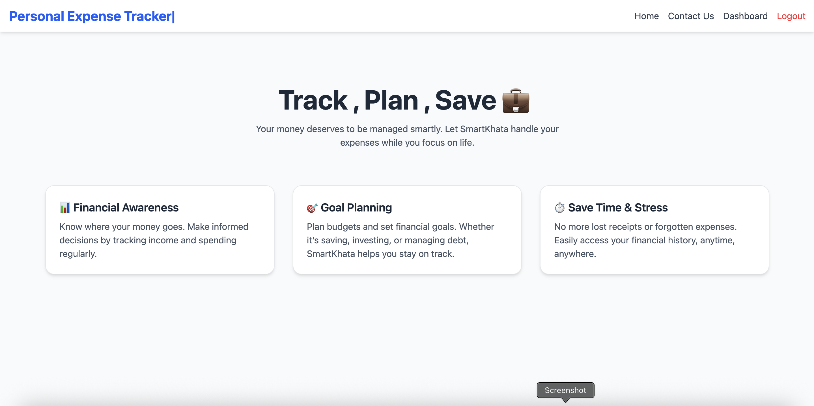

# 💼 SmartKhata – Personal Finance Tracker

🔗 Live App: [smart-khata-client.vercel.app](https://smart-khata-client.vercel.app/)
🔗 API Endpoint: [smart-khata-api.onrender.com](https://smart-khata-api.onrender.com/)
📦 GitHub: [github.com/Arbab-ofc/smartKhata](https://github.com/Arbab-ofc/smartKhata)

---

## 📌 Project Overview

**SmartKhata** is a MERN stack-based personal finance management web application designed to help users track their income, expenses, and overall savings in a smart and intuitive way.

This application offers:

- 📊 Real-time transaction tracking
- 📈 Visual statistical insights (charts, graphs)
- 🔐 Authentication with secure session handling
- 💡 Intuitive UI with responsive design
- 🧠 Insightful savings feedback

---

## 🚀 Tech Stack

### Frontend:

- ⚛️ **React**
- 🌐 **Axios** for API calls
- 🎨 **TailwindCSS** for styling
- 📊 **Recharts** for data visualization

### Backend:

- 🧠 **Node.js** + **Express.js**
- 🛢 **MongoDB** (Mongoose ODM)
- 🔐 **JWT Auth** + Cookies for session handling
- 📦 RESTful API architecture

---

## 🌟 Features

- ➕ Add / Update / Delete Transactions
- 📂 Category-based transaction tracking
- 📊 Recharts-powered visual stats (Bar & Pie Chart)
- 💬 Smart feedback based on savings trends
- 📱 Fully responsive UI (Mobile, Tablet, Desktop)
- ⚠️ Graceful error handling for API and network issues

---

## 📷 Preview

| 💻 Desktop                                                                         | 📱 Mobile                                                                        |
| ---------------------------------------------------------------------------------- | -------------------------------------------------------------------------------- |
|  |  |

*📌 (Add actual screenshots or gif here to make it visual)*

---

## 🛠 Installation (For Local Development)

```bash
# Clone the repository
git clone https://github.com/Arbab-ofc/smartKhata.git

# Navigate into the project directories and install dependencies
cd client
npm install

cd ../server
npm install
```

## 🧪 Run the project

```bash
# Start the server
cd server
npm start
# Start the client in another terminal
cd ../client
npm start
```
## 🌐 Access the App
Open your browser and navigate to `http://localhost:3000` to access the SmartKhata app.
## 📄 API Documentation
For detailed API documentation, refer to the [API Documentation](https://smart-khata-api.onrender.com/api-docs) endpoint.
## 📝 Contributing
We welcome contributions! Please follow these steps:
1. Fork the repository
2. Create a new branch (`git checkout -b feature/YourFeature`)
3. Make your changes
4. Commit your changes (`git commit -m 'Add some feature'`)
5. Push to the branch (`git push origin feature/YourFeature`)
6. Open a Pull Request
## 📜 License
This project is licensed under the MIT License. See the [LICENSE](LICENSE) file for details.
## 📞 Contact 
For any queries or issues, feel free to reach out: smartkhataofc@gmail.com
## 🙏 Acknowledgements
Special thanks to the open-source community for their invaluable contributions and resources that made this project possible.
## 📚 Learning Resources
- [MERN Stack Documentation](https://mern.io/)
- [React Documentation](https://reactjs.org/docs/getting-started.html)
- [Node.js Documentation](https://nodejs.org/en/docs/)
## 🛠️ Tools Used

- **VS Code**: Code editor for development
- **Postman**: API testing and debugging
- **Git**: Version control
- **GitHub**: Repository hosting and collaboration
- **Vercel**: Frontend deployment
- **Render**: Backend deployment

## 🙋‍♂️ Author
- Made with ❤️ by Arbab Arshad

## ⭐️ Show your support
-- ⭐️ Star this repo
-- 🍴 Fork it
-- 🧑‍💻 Contribute

## “Track smart, spend smarter – with SmartKhata 💼”